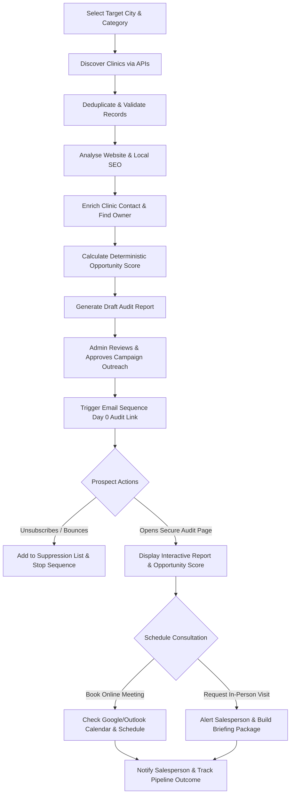
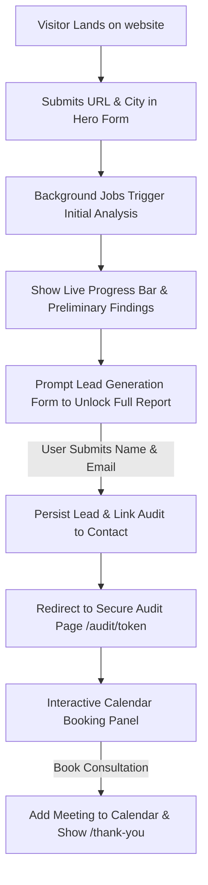
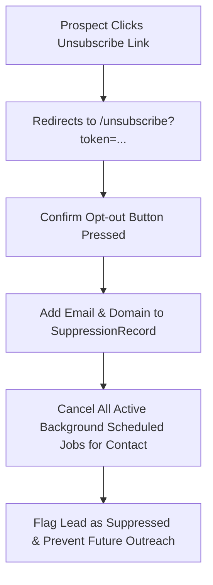

# Product Flow

This document details the core business flows of the Smile AI Marketing platform, tracing both inbound (self-serve audit tool) and outbound (automated campaign prospecting) paths.

---

## 1. Outbound Platform Flow (Clinic Discovery & Outreach)

### Detailed Steps:
1. **Targeting**: Admin selects target parameters (e.g., "Chicago", "Pediatric Dentist").
2. **Discovery**: Background worker queries business directories or local search APIs.
3. **Deduplication**: System screens out duplicate addresses, invalid phone numbers, and domains already in outreach or client lists.
4. **Analysis & Scoring**: Automated crawlers test site performance (via Lighthouse/PageSpeed), schema tags, SSL, Google Maps presence, review score, and competitor rank. Opportunity score (0-100) is calculated.
5. **Contact Enrichment**: Scrapes domain and social channels to identify the decision-maker (e.g., owner, clinical director, manager) and verifies email integrity.
6. **Report Compilation**: Generates an audit draft with estimated metrics (never fabricating numbers) and formats it as a secure PDF and web page.
7. **Human Gate**: Admin reviews the audit draft and contact details, then hits "Approve".
8. **Outreach Cadence**: Starts a multi-day cold email sequence with a direct link to the clinic's private audit token (`/audit/[publicToken]`).
9. **Conversion**: Prospect views their private report and interacts with the calendar widget to book a consultation.

---

## 2. Inbound Visitor Flow (Landing Page Lead Magnet)

### Detailed Steps:
1. **Initial Submission**: A user visits `/` or `/free-dental-audit` and inputs their clinic's website domain, city, and clinic name.
2. **Dynamic Preview**: The web app calls a fast endpoint to perform quick checks (e.g., mobile responsiveness, PageSpeed rating) and renders a loading states sequence.
3. **Lead Gate**: To unlock the detailed scorecard (reviews, local map pack rankings, competitor comparisons), the visitor must input their first name, last name, professional email, and role.
4. **Report Access**: Upon submission, a secure, unique `publicToken` is generated. The page redirects to `/audit/[publicToken]`.
5. **Call-To-Action**: The user views their dental scorecard and is offered direct options to book an online consultation or request a clinic visit.

---

## 3. Compliance & Suppression Flow (Unsubscribe Flow)

- Every cold email template contains a unique, non-sequential unsubscribe URL.
- Once clicked, it writes to a system-wide `SuppressionRecord` table, immediately terminating any queued background outreach jobs for that recipient.
