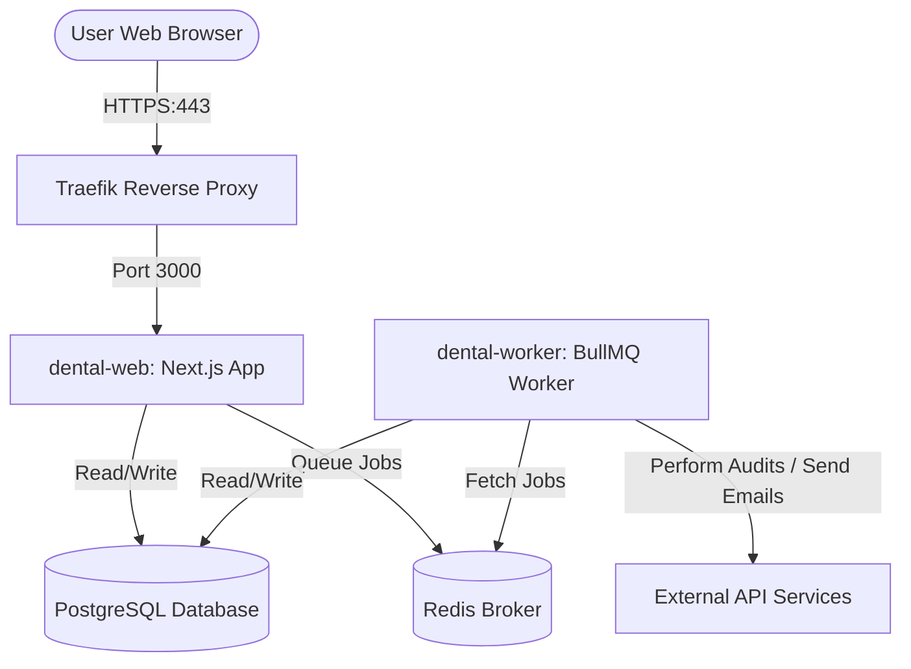
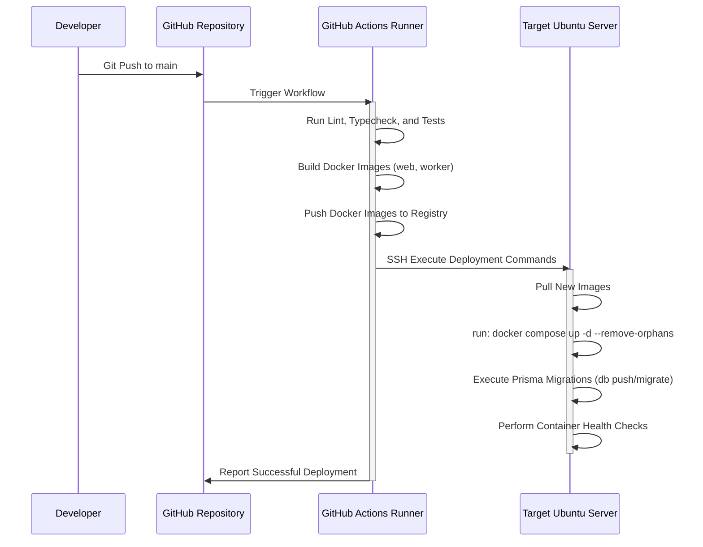

# System Architecture

This document defines the high-level system structure, network layout, background queuing, Traefik reverse proxy configuration, and CI/CD deployment model.

---

## 1. Process & Container Layout

The system runs as an isolated, containerized environment using **Docker Compose** on an Ubuntu host.

### Docker Services:
1. **`dental-web`**: Next.js App Router running on Node.js (production container built using multi-stage Dockerfile). Handles user-facing routes, API endpoints, and admin panels.
2. **`dental-worker`**: A dedicated, headless Node.js process running a BullMQ processor instance. Executes heavy-duty asynchronous scraping, scoring, and mail sending. Shares the codebase/Prisma schemas.
3. **`postgres`**: PostgreSQL database container (persisted via Docker volumes).
4. **`redis`**: Redis instance used for job queuing, background rate-limiting, and short-term cache (persisted via Docker volumes).
5. **`traefik`**: Edge router proxy managing SSL/TLS certificates automatically via Let's Encrypt (ACME) and routing traffic to `dental-web`.

---

## 2. Infrastructure & Networking

- **Internal Network**: All containers sit on a private bridge network (`dental-network`). PostgreSQL, Redis, and the worker container are **not** exposed to the host's public IP address.
- **Proxy Routing**: Only Traefik exposes ports `80` (redirected to `443`) and `443` (TLS) to the public host interface. Traefik inspects labels on the `dental-web` service to route traffic.
- **SSL Management**: Traefik automatically requests, provisions, and renews Let's Encrypt SSL certificates.

---

## 3. Background Job Architecture

The system uses **BullMQ** built on top of **Redis** for managing background processes.

- **Isolation**: Heavy operations (e.g., PDF generation, Puppeteer-based website analysis) run exclusively inside the `dental-worker` container. If a worker crashes, the main web server (`dental-web`) remains unaffected.
- **Concurrency Controls**:
  - `website analysis`: 2 concurrent jobs
  - `contact enrichment`: 2 concurrent jobs
  - `PDF generation`: 1 concurrent job
  - `outreach sending`: Throttle-controlled based on target inbox caps
  - `appointment processing`: 2 concurrent jobs
- **Resilience**: Every job implements retries (default: 3) with exponential backoff (e.g., 5s, 30s, 2m) to recover from transient external API errors.

---

## 4. CI/CD & Deploy Flow (GitHub Actions)

We use GitHub Actions to automate linting, type-checking, image building, and production deployment:

### GitHub Actions Pipeline Configuration Guidelines:
1. **Linter & Typecheck Gate**: The pipeline will immediately terminate if `npm run lint` or `npx tsc --noEmit` fails.
2. **Build Isolation**: Web and worker share a unified workspace, enabling shared types and DB schema access, but build distinct container tags.
3. **Zero-Downtime Deployment**: Docker Compose pulls the updated tags, restarts containers in sequence, and validates health checks.
